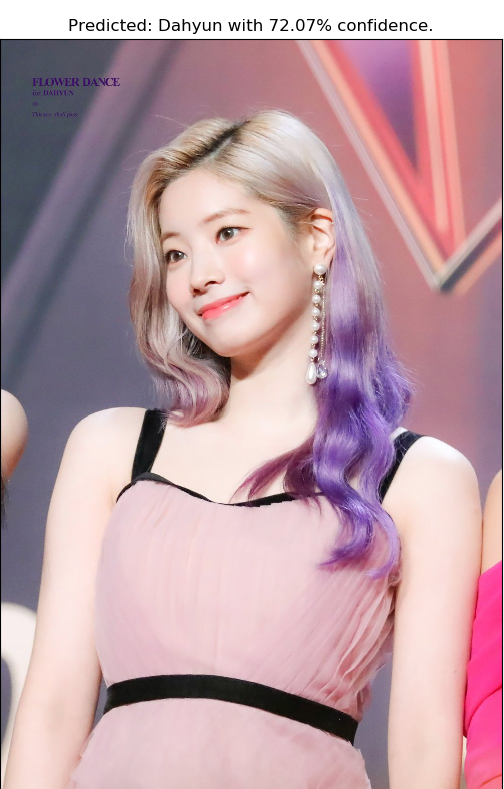
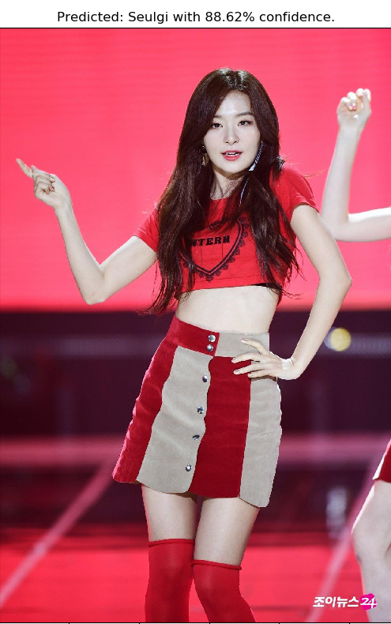
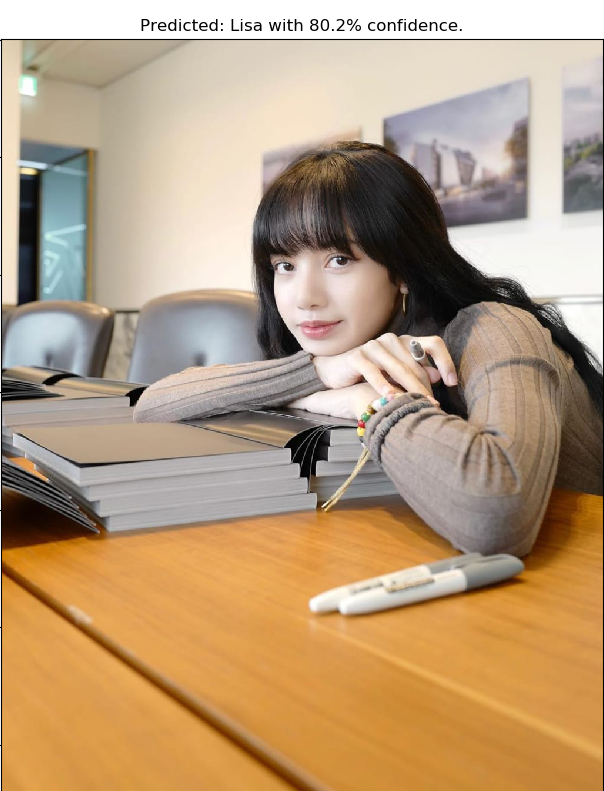
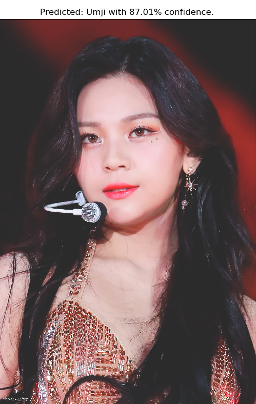

# Kpop Idol Face Classifier

This is a face recognition model aimed at classifying your favourite Kpop singers.

Uses a FaceNet + SVM model to train and classify faces.

The model currently supports recognizing Chaeyong, Chorong, Dahyun, Eunha, Irene, Jihyo, Lisa, Naeun, Nayeon, Sana, Seulgi, Umji, Yeji and Yuju.

,

## Requirements

- Keras 2.3.1 ( No need to have a GPU )
- dlib
- sklearn
- numpy
- OpenCV

Install the above (preferably in a conda environment) and download the data.

Download the FaceNet model from [here](https://drive.google.com/drive/folders/1pwQ3H4aJ8a6yyJHZkTwtjcL4wYWQb7bn), and place it inside the model folder.

## Data

You can use your own dataset, where each person should have at least 10-15 images.

The directory structure should look like this

- data
    - raw_data
        - Person_1
            - pic1.jpg
            - pic2.jpg
        - Person 2
            - pic1.jpg
            - pic2.jpg

Now run process.py, which will crop the faces and put them in the 'play' folder.

## Usage
To use the model as it is, put your images in the 'play' folder and run 'python main.py'.

To add support for more artists, 
Download the photos and put them under the raw_data folder. Run 'python process.py' and then 'python train.py'.

Cheers!

## Samples

